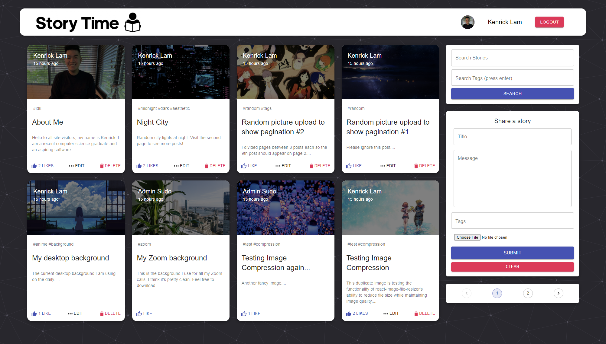

# story-time

A social media web application where users can read and share stories about anything!\
Note: Initial website load time may take up to 10 seconds due to Heroku cold start.

Client-side (main website) is hosted at: https://story-time-web.netlify.app

Server-side is hosted on Heroku.

This web application uses the MERN stack (MongoDB, Express, React, Node) and also incorporates popular React libraries like Redux for managing global state and Material-UI for user interface design. Account authorization is handled through Google OAuth if signing in via Google, or JSON Web Tokens with hashed passwords if manually signing up. Other cool features include: pagination, searching posts by their title/tags, and commenting on posts to communicate with other users. Feel free to make an account and share some of your own interesting stories, I would love to read them!\
\
Here is a preview of the website:

