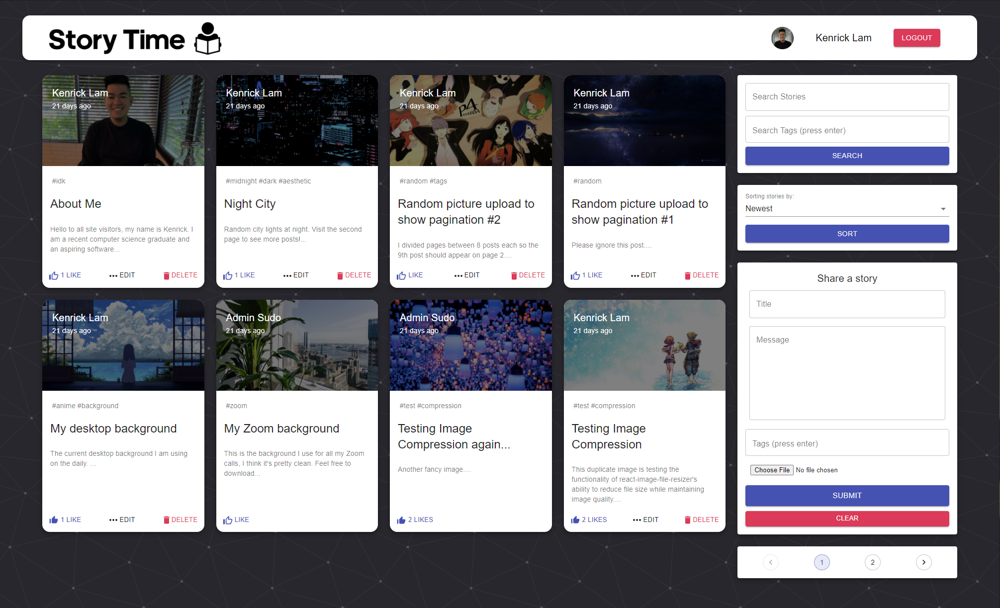
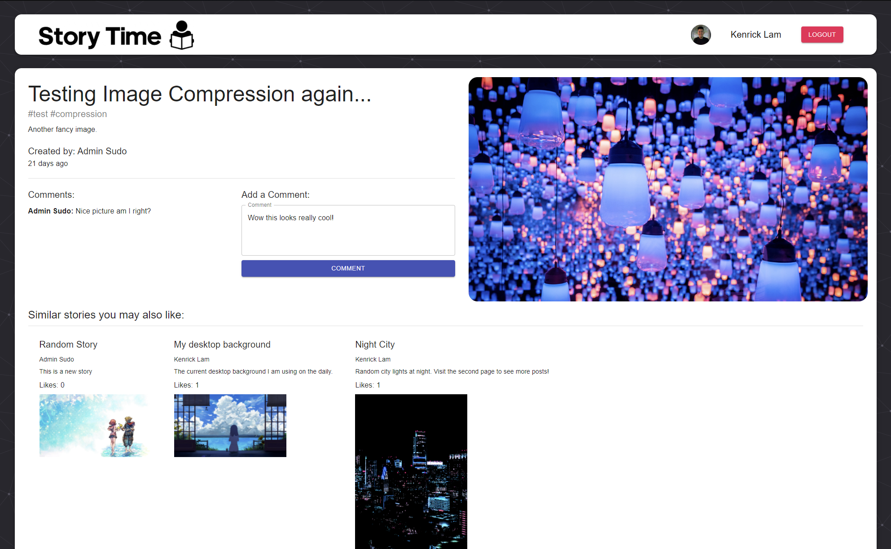

# story-time

A social media web application where users can read and share stories about anything!\
Note: Initial website load time may take up to 10 seconds due to Heroku cold start.

Client-side (main website) is hosted at: https://story-time-web.netlify.app
\
Server-side is hosted at: https://story-time-api.herokuapp.com

This web application uses the MERN stack (MongoDB, Express, React, Node) and also incorporates popular React libraries like Redux for managing global state, Material-UI for user interface design, and Router for client-side navigation. Account authorization is handled through Google OAuth 2.0 if signing in via your Google account, or JSON Web Tokens with hashed passwords if the user decides to sign up manually. Feel free to make an account and share some of your own interesting stories, I would love to read them!\
\
Here is a preview of the website's homepage. Any user can browse, search, or sort stories as they wish. Logged in users have additional features such as liking other people's stories and creating/editing/deleting their own stories.

Stories also have their own individual pages that have recommendations to other similar stories based on their matching tags. Logged in users can also comment on any of these stories.

